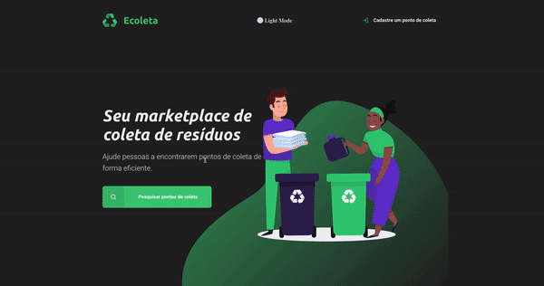

<p align="center">
    
</p>

<h1 align="center">
   ♻️ Next Level Week: Starter ♻️
</h1>

<p align="center">


</p> 

<p align="center">
  <a href="#computer-project">About the Project</a>&nbsp;&nbsp;&nbsp;|&nbsp;&nbsp;&nbsp;
  <a href="#rocket-built-with">Technologies</a>&nbsp;&nbsp;&nbsp;|&nbsp;&nbsp;&nbsp;
  <a href="#information_source-how-to-run">Getting Started</a>&nbsp;&nbsp;&nbsp;|&nbsp;&nbsp;&nbsp;
  <a href="#mailbox-Contacts">Contacts</a>&nbsp;&nbsp;&nbsp;|&nbsp;&nbsp;&nbsp;  
  <a href="#page_facing_up-license">License</a>&nbsp;&nbsp;&nbsp;|&nbsp;&nbsp;&nbsp;
</p>

<br>

<p align="center">
  
</p>

<br>

## 💻 About the Project 

♻️ Ecoleta ♻️ This project was made at the Next Level Week event, where companies with Eco points can create a register so that people can search the best and nearest places to dispose of their waste.


## 🛠 Technologies

This project was built with:

- [HTML5](https://developer.mozilla.org/en-US/docs/Web/Guide/HTML/HTML5)
- [CSS3](https://developer.mozilla.org/en-US/docs/Web/CSS)
- [JavaScript](https://developer.mozilla.org/en-US/docs/Web/JavaScript)
- [Nodejs](https://nodejs.org/)
- [yarn](https://yarnpkg.com/)
- [Express](https://expressjs.com/)
- [Nunjucks](https://mozilla.github.io/nunjucks/getting-started.html)
- [Postgres](https://www.postgresql.org/)

## 🚀 Getting Started

**Clone or Download the Repository**

```bash
$ git clone https://github.com/Johnny-Saraiva/ecoleta-starter.git

$ cd ecoleta-starter
```

**Installing Dependencies**

```bash
# if you use yarn, run this:

$ yarn
```
or
```bash
# if you use npm, run this:

$ npm install
```
**Running the Project**

```bash
# if you use yarn, run this:

$ yarn start
```
or
```bash
# if you want to use npm, run this:

$ npm start
```

## 📬 Contacts

Connect with me on [LinkedIn](https://www.linkedin.com/in/johnny-saraiva-701641164/).

## 📝 Licença

This project is under the MIT license. See the [LICENSE](LICENSE.md) for more information..

---

Made with ❤️ by Johnny Saraiva 👋 [Get in touch!](https://www.linkedin.com/in/johnny-saraiva-701641164/)

